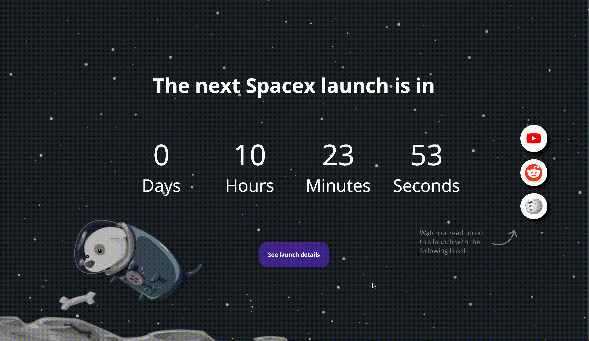
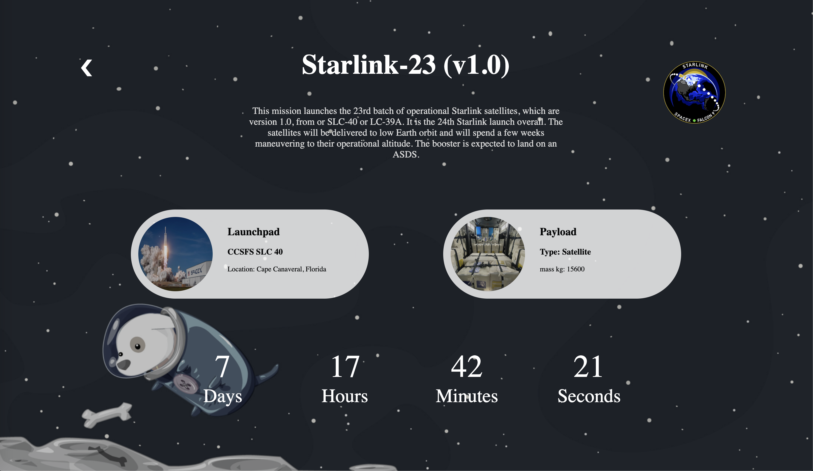

# Spacex next launch app


This app shows a countdown to the upcoming spacex apps and details about this launch. You can find links to the livestream (if there is one) or information about the campaign through reddit or wikipedia aswell as information about the launchsite and the payload.

see the client version live demo [here!](https://jimmydekroon.github.io/web-app-from-scratch-2021/src/index.html)

## Instructions (How to use)
- Download or clone the repository
- Navigate to the /src folder in the terminal
- Install using: npm install
- Start a server with npm start

</br>
</br>

## The Spacex API

- Visit the API github repository here [Spacex API](https://github.com/r-spacex/SpaceX-API).
- Information about the endpoints and how to get there [Spacex docs](https://github.com/r-spacex/SpaceX-API/blob/master/docs/v4/README.md)
- Request limit: 50 requests per second.

The main endpoint to be used is /next (https://api.spacexdata.com/v4/next). This is where the information about the upcoming launch is stored. Values like the next launch date and links to livestreams etc. are taken from here. Detailed information is taken from their endpoints attached with an id. For example: the launchpad to be used can be found in (https://api.spacexdata.com/v4/next) as an id. This id can then be used to look for information about the specific launchpad (https://api.spacexdata.com/v4/launchpad/:id).

This fetch will give you data about the upcoming launch
```JS
fetch('https://api.spacexdata.com/v4/launches/next')
```

this fetch will give you data about a specific payload
```JS
fetch('https://api.spacexdata.com/v4/payloads/:id')
```

Request limit information: 50 requests per second.



# Server Side Rendering
Setting up this progressive webapp was difficult, it was the first time using node for me so i needed some extra time to learn and experiment. This webapp has 2 main pages, the "home" page ('/') and the "details" page ('/details/:id').

```js 
let launchpadid
let payloadid

app.get('/', async function(req, res) {
	const response = await fetch('https://api.spacexdata.com/v4/launches/next');
	const data = await response.json();

	// console.log(data);

	res.render('index', {
		launchDataNext: data
	});

	launchpadid = data.launchpad
	payloadid = data.payloads[0]
});
```

The standard route fetches data for the next spacex launch, then it renders the index.ejs file and sends the launchdata with it. The variables launchpadid & payloadid are updated so i can acces specific i need in the detail route.

``` js
app.get('/details/:id', async function(req, res) {
	
	function fetchJSON(url) {
		return fetch(url).then(response => response.json());
	}

	let urls = [
		'https://api.spacexdata.com/v4/launches/' + req.params.id,
		'https://api.spacexdata.com/v4/launchpads/' + launchpadid,
		'https://api.spacexdata.com/v4/payloads/' + payloadid,
		'https://api.spacexdata.com/v4/launches/next'
	  ];
	
	let promises = urls.map(url => fetchJSON(url));
	
	Promise.all(promises).then(responses => {
		var launchDataId = responses[0];
    	var launchpadData = responses[1];
    	var payloadData = responses[2];
    	var launchDataNext = responses[3];

		res.render('details', {
			launchDataId: launchDataId,
			launchpadData: launchpadData,
			payloadData: payloadData,
			launchDataNext: launchDataNext
		})
	});
});
```

The second route does multiple fetchrequests using promise.all. Then the details page is rendered and data is send about specific endpoints in their own dataobject. Pages are then rendered using EJS.

Currently i use some client side javascript to make the countdown, one of the things i would like to improve on this webapp is making the countdown function server side.

# Progressive Web App


