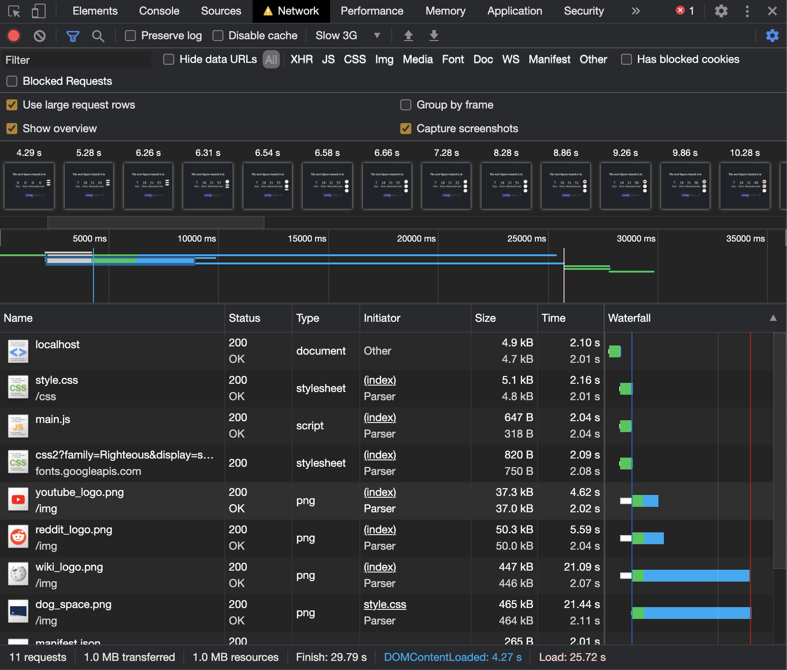

# Spacex next launch app


This app shows a countdown to the upcoming spacex apps and details about this launch. You can find links to the livestream (if there is one) or information about the campaign through reddit or wikipedia aswell as information about the launchsite and the payload.

see the client version live demo [here!](https://jimmydekroon.github.io/web-app-from-scratch-2021/src/index.html)

## Instructions (How to use)
- Download or clone the repository
- Navigate to the /src folder in the terminal
- Install using: npm install
- Start a server with npm start

</br>
</br>

## The Spacex API

- Visit the API github repository here [Spacex API](https://github.com/r-spacex/SpaceX-API).
- Information about the endpoints and how to get there [Spacex docs](https://github.com/r-spacex/SpaceX-API/blob/master/docs/v4/README.md)
- Request limit: 50 requests per second.

The main endpoint to be used is /next (https://api.spacexdata.com/v4/next). This is where the information about the upcoming launch is stored. Values like the next launch date and links to livestreams etc. are taken from here. Detailed information is taken from their endpoints attached with an id. For example: the launchpad to be used can be found in (https://api.spacexdata.com/v4/next) as an id. This id can then be used to look for information about the specific launchpad (https://api.spacexdata.com/v4/launchpad/:id).

This fetch will give you data about the upcoming launch
```JS
fetch('https://api.spacexdata.com/v4/launches/next')
```

this fetch will give you data about a specific payload
```JS
fetch('https://api.spacexdata.com/v4/payloads/:id')
```

Request limit information: 50 requests per second.


# Packages
npm packages used in this project

- Express [Link](https://expressjs.com/)
- EJS [link](https://ejs.co/)
- node-fetch [link](https://www.npmjs.com/package/node-fetch)

## Dev dependencies

- nodemon [link](https://www.npmjs.com/package/nodemon)


# Server Side Rendering
This project was built using node.js and serves as a chance for me to learn about some back-end & optimilization.  This webapp has 2 main routes, the "home" page ('/') and the "details" page ('/details/:id').

```js 
let launchpadid
let payloadid

app.get('/', async function(req, res) {
	const response = await fetch('https://api.spacexdata.com/v4/launches/next');
	const data = await response.json();

	// console.log(data);

	res.render('index', {
		launchDataNext: data
	});

	launchpadid = data.launchpad
	payloadid = data.payloads[0]
});
```

The standard route fetches data for the next spacex launch, then it renders the index.ejs file and sends the launchdata with it. The variables launchpadid & payloadid are updated so i can acces specific i need in the detail route.

``` js
app.get('/details/:id', async function(req, res) {
	
	function fetchJSON(url) {
		return fetch(url).then(response => response.json());
	}

	let urls = [
		'https://api.spacexdata.com/v4/launches/' + req.params.id,
		'https://api.spacexdata.com/v4/launchpads/' + launchpadid,
		'https://api.spacexdata.com/v4/payloads/' + payloadid,
		'https://api.spacexdata.com/v4/launches/next'
	  ];
	
	let promises = urls.map(url => fetchJSON(url));
	
	Promise.all(promises).then(responses => {
		var launchDataId = responses[0];
    	var launchpadData = responses[1];
    	var payloadData = responses[2];
    	var launchDataNext = responses[3];

		res.render('details', {
			launchDataId: launchDataId,
			launchpadData: launchpadData,
			payloadData: payloadData,
			launchDataNext: launchDataNext
		})
	});
});
```

The second route does multiple fetchrequests using promise.all. Then the details page is rendered and data is send about specific endpoints in their own dataobject. Pages are then rendered using EJS.

Currently i use some client side javascript to make the countdown, one of the things i would like to improve on this webapp is making the countdown function server side.


# Install the app locally

This app can be installed as a local app through the browser, click on the down arrow to the right of the adress bar.


## Service worker & caching

``` js
const cacheAssets = [
    '/',
    '/css/style.css',
    '/main.js',
    '/offline'
];
```

I cache the following files on the service worker install. Using a fetch event i check if the current page is in the cache, if it is the page is then served from the cache. If the user is offline and the page is not in the cache the offline page is served.


# Critical render path

The main network issues with this website came from the images. Images were very large and made the first page render very slow. 



This screenshot shows the situation before doing any optimizing. The main issue is the image file size and the fact that images start loading in after the css and js are done. Waiting for the css en js means 2 seconds are wasted before the images start loading.

``` html
<link rel="preload" href="/img/dog_space.png" as="image">
```

In order to solve this issue i added a preload to the \<head>. This makes the image load earlier. The images were still very large and took a lot of time to load so i resized all of the images to around the size i was using them on. This had the most dramatic effect as it changed some files to 10% of the original.


After this optimization the load times on slow 3G are drastically lower, going ~25 seconds to ~8 seconds!

## Lighthouse

Lighthouse reflects these changes aswell.


The main issue in the performance is the largest contentful paint, this is mainly because of the large images. After the optimization my lighthouse score shot to 99.


## minify css

Even though it probably won't make much of a difference i wanted to minify my css, just so i know how it works. I used css-minify, a very simple version of minification. Since the file is already very small it did not make much of a difference but the file size went from ~5kb to ~3.5 kb. That is still a reduction of around 30%! So on larger files the difference could be drastic. (you can see this in the network screenshots).
